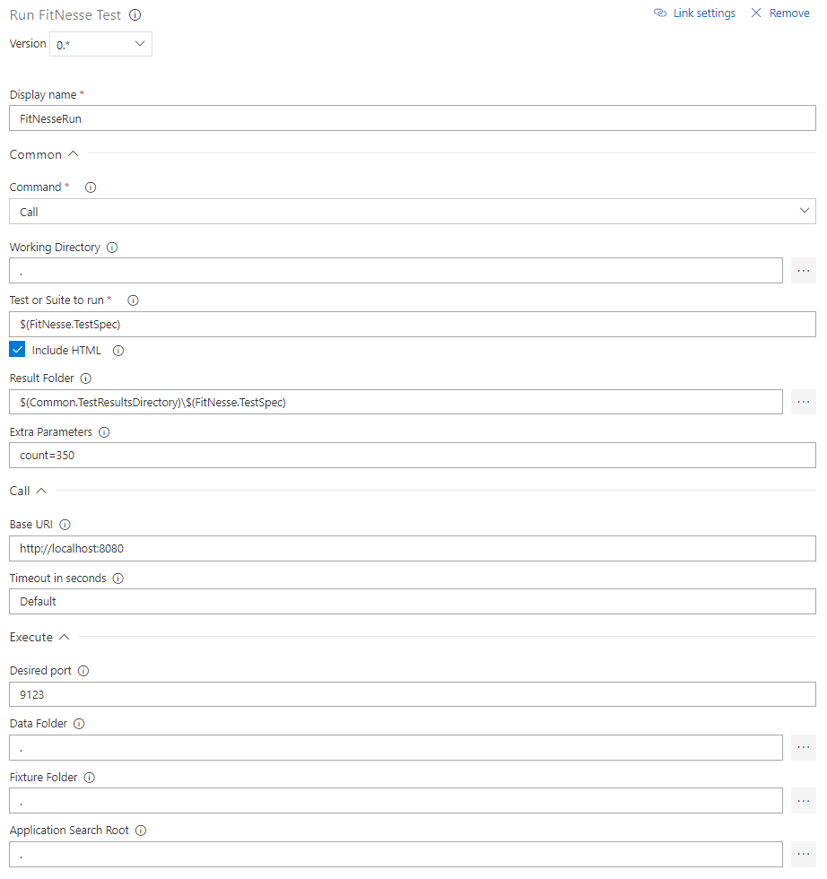

# FitNesseRun Task
Run a FitNesse test or suite on an existing FitNesse installation or by executing a local instance of FitNesse. The result is transformed into an NUnit 3 file that can be published to VSTS via a Publish Test Results 

## Parameters
### Common:
- **Command**: *Call* if using a REST call to an existing FitNesse instance; *Execute* if running FitNesse in 'single shot' mode on the agent.
- **Working Directory**: the working directory of the FitNesseRun task. Default is '.'.
- **Test or Suite to run**: the test or suite page that the task needs to run.
- **Include HTML**: whether or not to include the HTML test pages in the result (as an attachment)
- **Result Folder**: the folder where the output files will be placed.
- **Extra Parameters**: Extra variables to be passed to the FitNesse test/suite (format: *name1=value1&name2=value2*).

### For Call:
- **Base URI**: the URI of the existing FitNesse instance used (Call).
- **Timeout in Seconds**: the read timeout in seconds. Can be 'default' (normally 300s), or 'infinite' to wait forever

### For Execute:
- **Desired Port**: the port that the FitNesse to be executed should run on (will take the next free port if occupied)
- **Data Folder**: the folder for the FitNesse data (i.e. parent of the FitNesseRoot folder)
- **Fixture Folder**: the working directory of the FitNesse process, where it expects the fixtures.
- **Application Search Root**: the root folder where the task starts searching for FitNesse and FitSharp. It will take the first match it finds. 

## Results
The result file is called **results_nunit.xml** and is in NUnit 3 format, which can be read by the standard Publish Test Result task (version 2.\*). Each test page translates to a **test-case** entity. A summary of the assertions per page is provided in the **failure/message** entity of the test-case, since this was the only entity that could be used for this purpose. It will also be used if there are no failures, to make clear how many assertions there were on the page. 

If the IncludeHTML parameter is checked, then a detail test result file **DetailedResults.html** will be attached to the test suite results. It contains the results of all executed tests, which can be downloadad and visually inspected.

##Control Options
The task will fail if any of the tests fails. So in order for the test results publication to work, make sure to enable **Continue on error** in the control options for FitNesseRun, and in Publish Test Results, switch **Run this task** to **Even if a previous task has failed, unless the build was canceled**.

##What's New 
- 0.3.13: Worked around inability to parse <?xml?> tags inside FitNesse tables
- 0.4.0: added attachment capability to NUnit 3 output to store raw HTML test results (DetailResults.html)
- 0.4.3: Introduced TimeoutSeconds parameter to allow for long running tests. Updated screenshots to new VSTS UI.
- 0.4.4: Removed embedded html results in NUnit 3 result file, as attaching a result file separately is now possible.
- 0.4.5: Detailed results file is now HTML 5 rather than XHTML 1.1 (it wasn't entirely xhtml compliant)
- 0.4.6: start time, stop time and duration for test runs not delivering results were made more accurate; introduced test run name defaults for those.
- 0.4.7: Upgrade to VstsTaskSdk 0.11, simplified NUnit 3 result by eliminating superfluous elements
- 0.4.8: Disabled output escaping for URL display in error reporting (&amp; -> &)
- 0.4.9: Changed content for exception message to CDATA; introduced stack-trace.
- 0.4.32: Fixed bug with handling empty test pages; cleaned up logging (more to debug). 

#FitNesseConfigure task
Configure a FitNesse/FitSharp installation using already downloaded packages (e.g. via NuGet)
It will setup a data environment for FitNesse with the following content: 
- a plugins.properties file for use with FitSharp and the Slim test system.
- If under the packages folder tree folders are found with the name 'wiki', they will be copied to the 'FitNesseRoot' folder (including subtree
- Folders with the name 'Fixtures' will be copied to the Fixtures folder in the data environment. 

## Parameters	
- **Target Folder**: The location where the data environment for FitNesse needs to be configured. Default is '.'
- **Package Folder**: the folder under which the packages have been downloaded (i.e. where FitNesse and FitSharp can be found). Default is '.' 
- **Port**: the port that FitNesse needs to run at when executed. Default is 9123
- **Slim Port**: THe port where the FitSharp Slim service runs at. Default is 8085
- **Siim Pool Size**: the number of consecutive ports that Slim can use (starting at Slim Port). Default is 5
- **Slim Timeout**: Timeout in seconds for the Slim server. Default is 30 seconds
- **Cleanup Target**: Whether or note the target folder should be cleaned before configuring. Default is yes.

## Return Variables
- **FitNesse.StartCommand**: the command to start FitNesse using this configuration
- **FitNesse.WorkFolder**: the work folder that needs to be used for this configuration

##What's New 
- 0.4.10: Initial release
- 0.4.14: Added Cleanup Target toggle
- 0.4.15: Bug fixes with moving Wiki content to FitNesseRoot and in content generation of plugins.properties; new icon; added firewall rules for incoming traffic on FitNesse and FitSharp ports
- 0.4.16: Introduction of Unblock Ports toggle 
- 0.4.32: Support running browser based tests (Chrome, Firefox, IE) on hosted agents; cleaned up logging (more to debug) 
- 0.4.34: Introduced support for partial plugins.properties.* files (added to plugins.properties to support classic plugins)