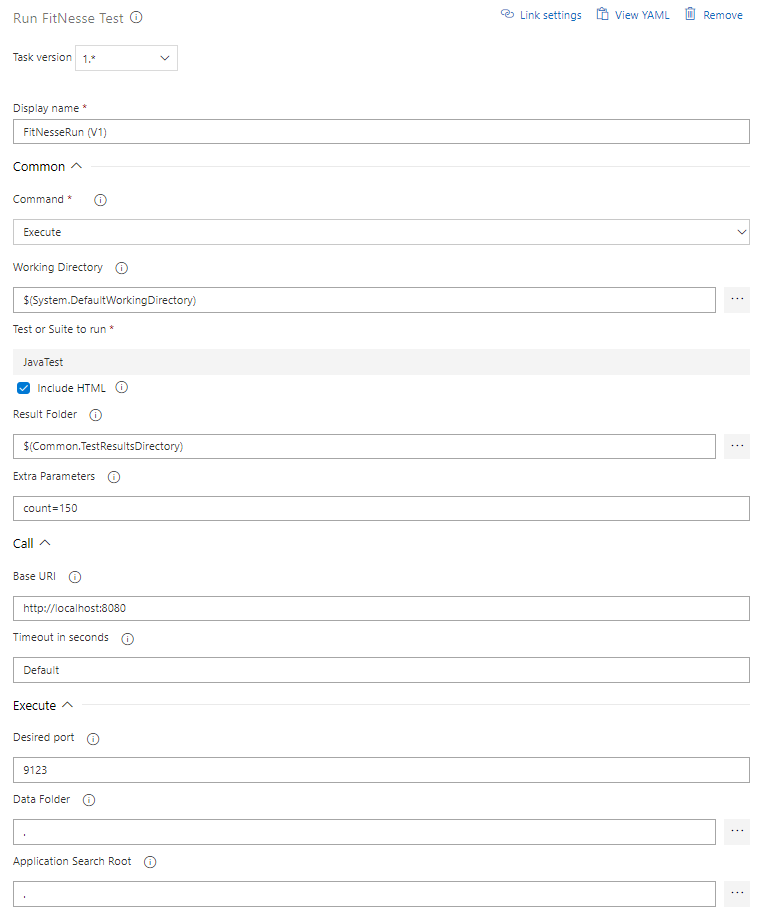

# FitNesseRun Task
Azure Pipelines task to run a FitNesse test or suite on an existing FitNesse (http://fitnesse.org) installation or by executing a local instance of FitNesse. The result is transformed into an NUnit 3 file that can be published to Azure DevOps via a Publish Test Results 

## Parameters
### Common:
- **Command**: *Call* if using a REST call to an existing FitNesse instance; *Execute* if running FitNesse in 'single shot' mode on the agent
- **Working Directory**: the working directory of the FitNesseRun task. Default is '.'
- **Test or Suite to run**: the test or suite page that the task needs to run
- **Include HTML**: whether or not to include the HTML test pages in the result (as an attachment)
- **Result Folder**: the folder where the output files will be placed
- **Extra Parameters**: Extra variables to be passed to the FitNesse test/suite (format: *name1=value1&name2=value2*)

### For Call:
- **Base URI**: the URI of the existing FitNesse instance used
- **Timeout in Seconds**: the read timeout in seconds. Can be 'default' (normally 300s), or 'infinite' to wait forever
- For **Test or Suite to run**, you can enter ':shutdown' (notice the colon) to shut down the FitNesse instance being called

### For Execute:
- Leave **Test or Suite to run** empty if you only want to start FitNesse (this allows for using a subsequent FitNesseRun Call)
- **Desired Port**: the port that the FitNesse to be executed should run on (will take the next free port if occupied)
- **Data Folder**: the folder for the FitNesse data (i.e. parent of the FitNesseRoot folder). This is also where the fixtures are expected
- **Application Search Root**: the root folder where the task starts searching for FitNesse (typically same as Data Folder). It will take the first match it finds

## Results
The result file is called **results_nunit.xml** and is in NUnit 3 format, which can be read by the standard Publish Test Result task (version 2.\*). Each test page translates to a **test-case** entity. A summary of the assertions per page is provided in the **failure/message** entity of the test-case, since this was the only entity that could be used for this purpose. It will also be used if there are no failures, to make clear how many assertions there were on the page. 

If the IncludeHTML parameter is checked, then a detail test result file **DetailedResults.html** will be attached to the test suite results. It contains the results of all executed tests, which can be downloadad and visually inspected.

##Control Options
The task will fail if any of the tests fails. So in order for the test results publication to work, make sure to enable **Continue on error** in the control options for FitNesseRun, and in Publish Test Results, switch **Run this task** to **Even if a previous task has failed, unless the build was canceled**.

# FitNesseConfigure task
Configure a FitNesse/FitSharp installation using already downloaded content (e.g. via universal packages)
It will analyze the target folder, find FitNesse and, if available, FitSharp, and create a plugins.properties file accordingly.
It is assumed that FitNesseRun will use the target folder as its data folder, and that the process uses that folder as its working folder.
The task can also unblock the Wiki and Slim ports in the firewall, should be required (not needed on hosted agents).

## Parameters	
- **Target Folder**: The location where the data environment for FitNesse needs to be configured. Default is '.'
- **Port**: the port that FitNesse needs to run at when executed. Default is 9123
- **Slim Port**: The port where the FitSharp Slim service runs at. Default is 8085
- **Siim Pool Size**: the number of consecutive ports that Slim can use (starting at Slim Port). Default is 5
- **Slim Timeout**: Timeout in seconds for the Slim server. Default is 30 seconds
- **Unblock Ports**: Unblock FitNesse/Slim ports in the firewall

## Return Variables
- **FitNesse.StartCommand**: the command to start FitNesse using this configuration
- **FitNesse.WorkFolder**: the work folder that needs to be used for this configuration

# Release Notes
|Date|Note|
|---|---|
|3-May-2019|First release of V1 (V0 is also still available)|
|6-Jan-2020|Introduced mechanism to start and shutdown FitNesse as separate activities|